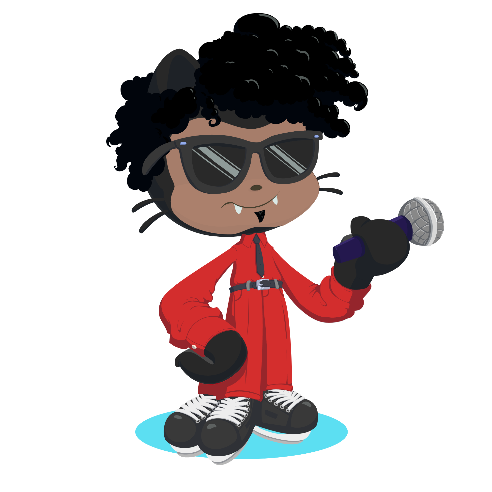

- Desenvolvedor Front-End
- Análise e Desenvolvimento de Sistemas na Fatec Ribeirão Preto (3/6)

##

      
 
- Atualmente aprendendo: 
  

 ##
  
   
  
 ##
 

  
   
  

  

  
 

  <h3 align="left">Minhas redes:</h3>
 
    
  
   
##
 
  
 

  
 
 
 
 
 
